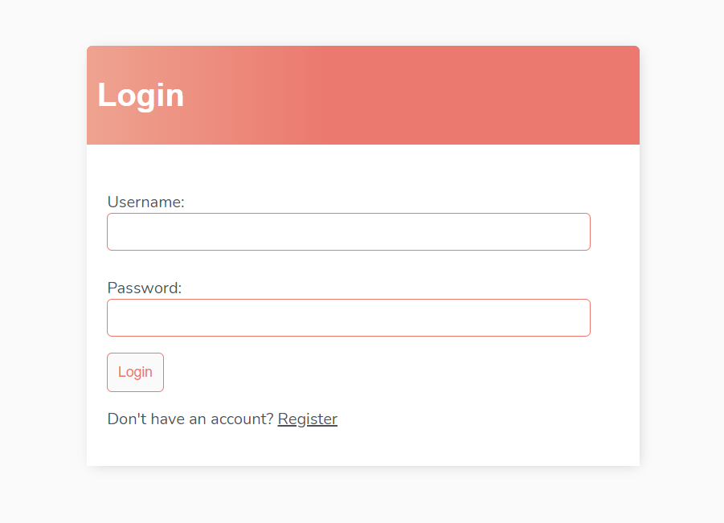
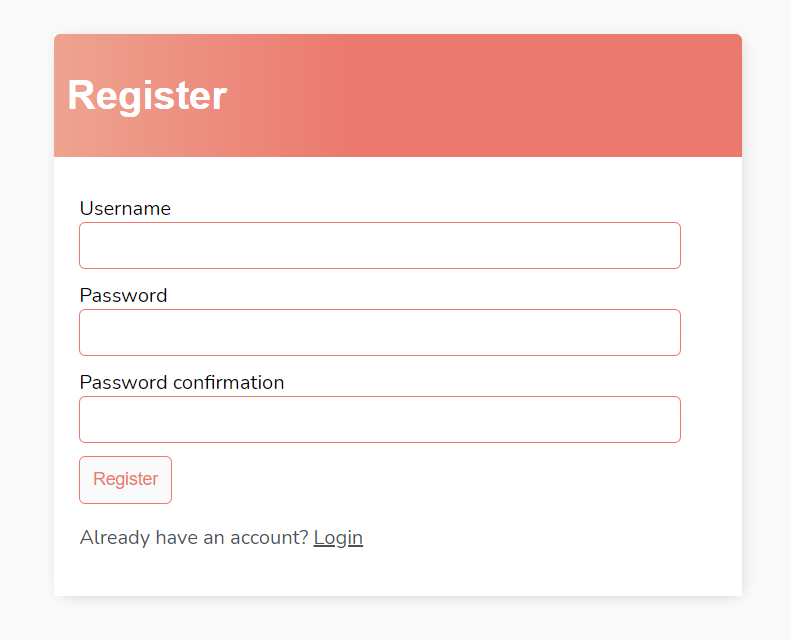
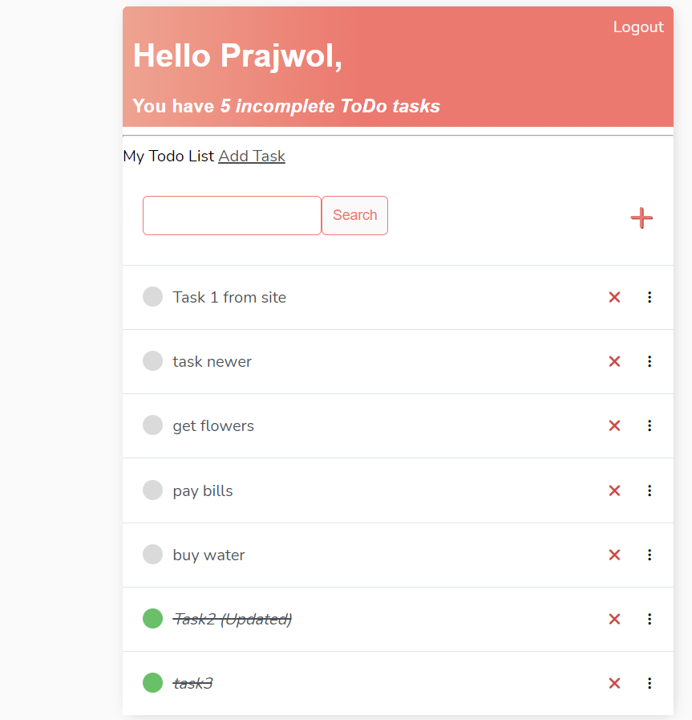
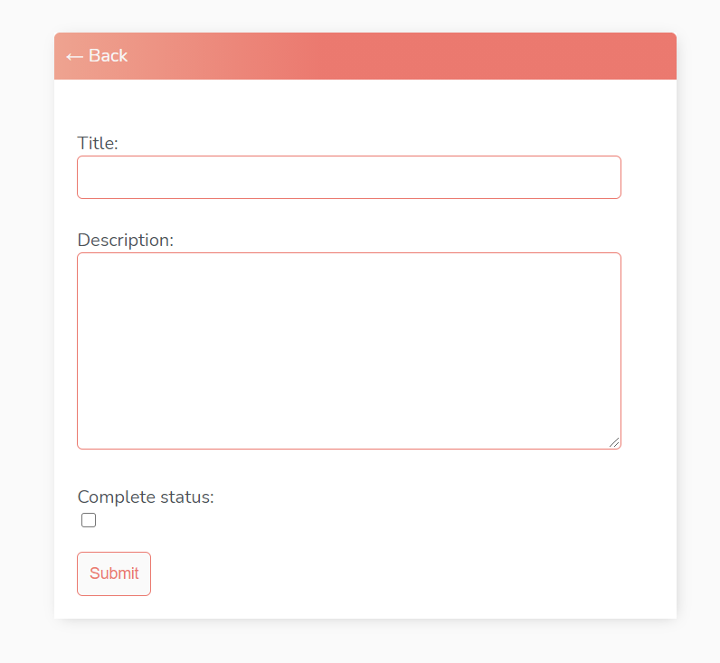

# Django Todo List App with User Authentication System

This todo list app is created with Django as backend and with no frontend frameworks expect the use of HTML, CSS.

- Users can register and login to the Todo list app
- Users can add, update, delete and view tasks to/from their Todo list.
- Shows number of incomplete tasks in the Todo list.

